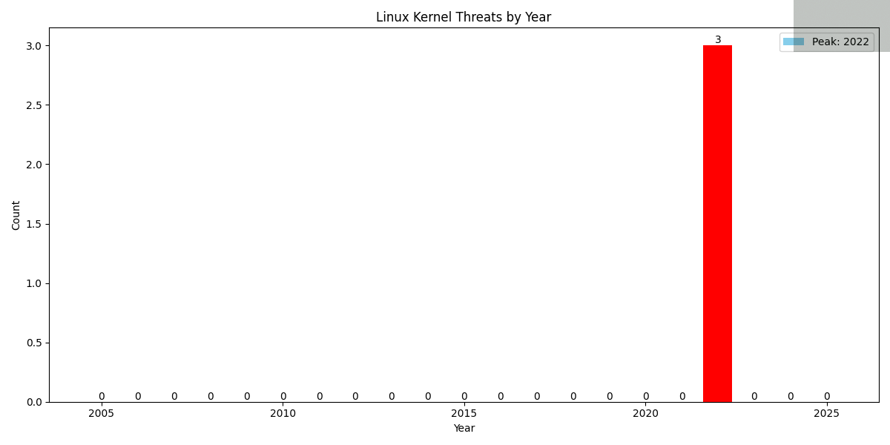
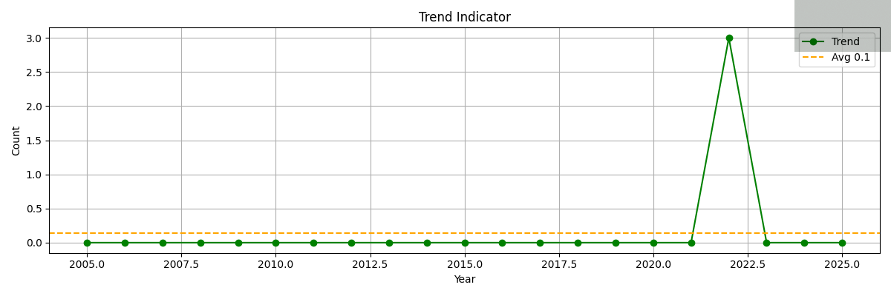

# Linux Kernel Threats Report

_Last updated: 2025-06-19T14:40:30.319698_

## Data Table

|Name|Created|Desc|CVSS|
|---|---|---|---|
|Critical Vulnerabilities in Internet-Exposed Linux Servers Allow Attackers to Perform RCE|2022-05-02T13:28:53.211000|Researchers at Rapid7 have detected around 2,000 Linux servers online that suffe...|0|
|Vulnerability in Dpkg Software|2022-06-01T04:48:39.851000|A vulnerability (CVE-2022-1664) has been identified in Dpkg Software {software a...|0|
|Muhstik Gang targets Redis Servers|2022-10-21T05:51:06.981000|Juniper Threat Labs has uncovered an attack that targets Redis Servers using a r...|0|

